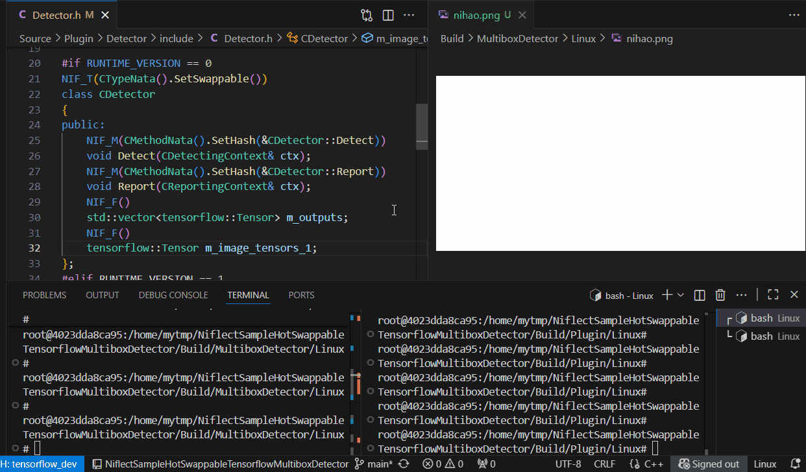

# Niflect 示例: TensorFlow 模型零停机热替换与字段级状态保持

本示例展示在模拟 AI 部署场景中, 当模型结构调整要求 C++ 侧相应修改字段时, 如何通过字段级热替换实现:

- **零停机模型替换** - 无需重开应用即可切换 AI 模型
- **状态保持** - 维持历史检测结果与运行时状态
- **原生性能** - 执行效率与静态编译代码相当

如需了解本示例方法的更多信息, 详见[介绍](https://github.com/sainimu78/NiflectSampleHotSwap)

## 演示工作流说明

检测功能基于 TensorFlow 官方示例移植，含两种模型实现, 来源路径为:

- `tensorflow/examples/label_image`
- `tensorflow/examples/multibox_detector` 

### `CDetector` 的版本 0

使用的模型为 label_image 中的图像分类模型, 用于模拟某种不合预期的检测实现

#### 录屏中与版本 0 相关的步骤说明

1. 运行 MultiboxDetector
2. 输入 `h`, 创建版本 0 的 `CDetector` 实例
3. 输入 `d`, 调用 `Detect`, 检测结果保存到 `m_outputs`
4. 输入 `r`, 调用 `Report`, 将 `m_outputs` 保存为图片 nihao.png
   - 此时可观察到检测蓝框处于错误的位置

### `CDetector` 的版本 1

使用的模型为 multibox_detector 中的物体检测模型, 用于模拟一种符合预期的检测实现

#### 录屏中与版本 1 相关的步骤说明

1. 将示例的版本宏 `RUNTIME_VERSION` 改为 1, 即模拟将 `CDetector` 修改为版本 1 的实现
2. 输入 `h`, 热替换版本 1 的 `CDetector` 实例
3. 输入 `r`, 调用 `Report`, 将之前版本 0 的结果 `m_outputs` 保存为图片
   - 此时可观察到由于版本 0 结果不符合版本 1 `Report` 的逻辑而产生更多位置错误的检测蓝框, 表明 `m_outputs` 已正确迁移
   - 另可观察到模型性能评估打印输出中的指标不正常, 表明新版本代码中的评估结果打印功能已生效
4. 输入 `d`, 调用 `Detect` 检测结果保存到 `m_outputs`
5. 输入 `r`, 调用 `Report`, 将 `m_outputs` 保存为图片 nihao.png
   - 此时可观察到检测蓝框处于正确的位置, 表明模拟的模型替换流程已完成并正确运行
   - 另可观察到模型性能评估打印输出中的指标正常, 表明模拟的性能反馈机制可进一步扩展